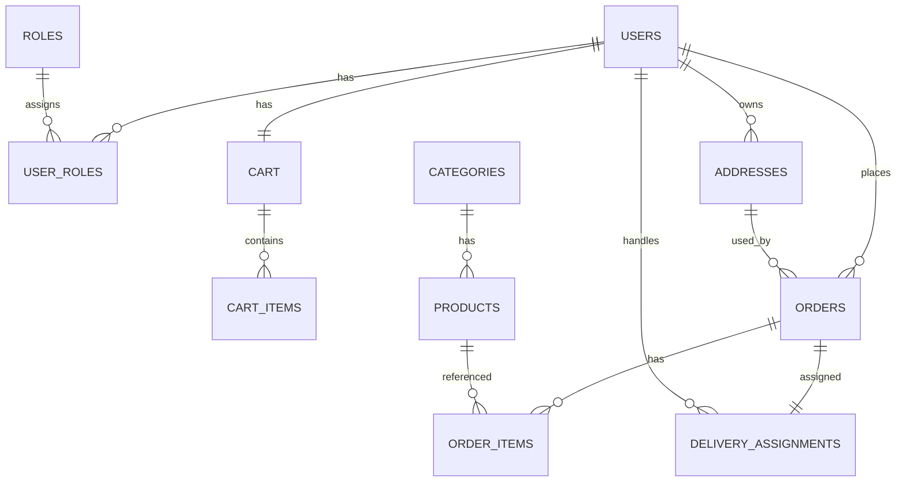

# ER Diagram (Mermaid)

```mermaid
erDiagram
  USERS ||--o{ USER_ROLES : has
  ROLES ||--o{ USER_ROLES : assigns
  USERS ||--o{ ADDRESSES : owns
  USERS ||--|| CART : has
  CART ||--o{ CART_ITEMS : contains
  CATEGORIES ||--o{ PRODUCTS : has
  USERS ||--o{ ORDERS : places
  ADDRESSES ||--o{ ORDERS : used_by
  ORDERS ||--o{ ORDER_ITEMS : has
  PRODUCTS ||--o{ ORDER_ITEMS : referenced
  ORDERS ||--|| DELIVERY_ASSIGNMENTS : assigned
  USERS ||--o{ DELIVERY_ASSIGNMENTS : handles
```
